# Introduction

This document provides a manual to use the LOKA Evaluation Board V2.4.

The Loka Module System is revolutionary in its ability to be both flexible and scalable. Is composed by a multi-purpose board, a device management and geo location tool. The objective is to be the IoT platform of choice due to low cost, high flexibility and availability.

The multipurpose module, whose main function is a standalone low cost tracker, can be used as a mother board or a daughter board allowing to connect a variety of sensors.
This revolutionary concept, addresses the cost and the Time to Market problem to introduce the many new services that are made possible by low power, low cost Sigfox network.

For more information click [here](http://www.loka.systems).

**Contents:**

-   [Introduction](#introduction)

-   [Board description](#board_description)
	
	-	[A - Screw Terminal](#screw_terminal)
	
	-	[B - Power Terminal](#power_terminal)
	
	-	[C - Horisontal Socket Terminal](#horisontal_socket_terminal)
	
	-	[D - Extension Terminal](#extension_terminal)
	
	-	[E - External Loka Connection Terminal](#external_loka)
	
	-	[F - Serial Programming Jumper Pins](#serial_jumpers)
	
	-	[G - Micro USB Connector](#micro_usb)
	
	-	[H - Peripheral power jumper terminal](#peripheral_power)
	
	-	[I - External Peripheral Connectors](#external_peripheral)
	
	-	[J - I2C Jumper terminal](#I2C_jumpers)
	
	-	[K - Enable LED jumper terminal](#LED_jumpers)
	
	-	[L - Buttons](#buttons)
	
	-	[M - LEDs](#leds)

-   [Default configuration](#default_configuration)

# Board description 

-   The image below is a representation of Evaluation Board V2.4. It has the legend of each part that compose the EB.

# Evaluation Board

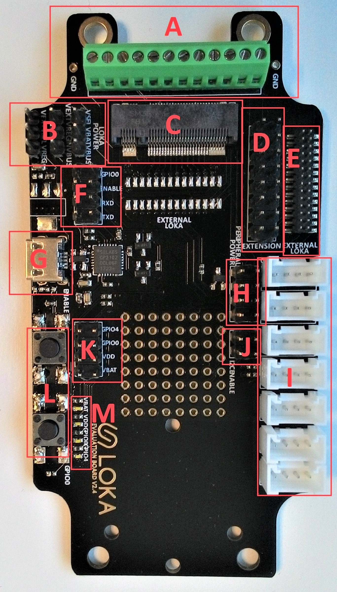

## A - Screw Terminal 

#### Screw Terminal Image
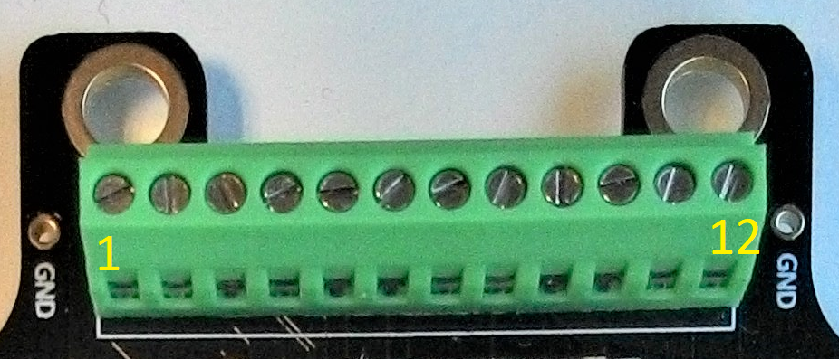

#### Screw Terminal Description Table

| Hdr # | PIN / GPIO | RTC GPIO | I/O Capability | Pull-Up / Pull-Down | ADC / DAC / SPI |
|-------|------------|----------|----------------|---------------------|-----------------|
| 1     | GND        |          |                |                     |                 |
| 2     | GPIO37     | GPIO1    | I              | NA                  | ADC1_CH1        |
| 3     | GPIO39     | GPIO3    | I              | NA                  | ADC1_CH3        |
| 4     | GPIO36     | GPIO0    | I              | NA                  | ADC1_CH0        |
| 5     | GPIO38     | GPIO2    | I              | NA                  | ADC1_CH2        |
| 6     | GPIO14     | GPIO16   | I/O            | NA                  | ADC2_CH6        |
| 7     | GPIO13     | GPIO14   | I/O            | NA                  | ADC2_CH4        |
| 8     | GPIO19     | NA       | I/O            | NA                  | NA              |
| 9     | VBAT       |          |                |                     |                 |
| 10    | VDD_PER    |          |                |                     |                 |
| 11    | GND        |          |                |                     |                 |
| 12    | VEXT       |          |                |                     |                 |

## B - Power Terminal 

#### Power Terminal Image
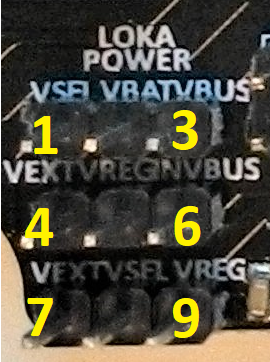

#### Power Terminal Description Table
| Pin # | Description | Note |
|-------|------------|------------|
| 1     | VSEL        | |
| 2     | VBAT     |LOKA power input|
| 3     | VBUS     | 5V from USB |
| 4     | VEXT     |    |
| 5     | VREGIN     | Voltage regulator power **input** |
| 6     | VBUS     | 5V from USB |
| 7     | VEXT     |    |
| 8     | VSEL      |   |
| 9     | VREG       | Voltage regulator power **output** |

**NOTES:**
1. The user has to see if 3.3V linear regulator is mouted. If is mouted, the jumper configuratuon to power LOKA with 3.3V is: 1-2,5-6,8-9
2. Default jumper configuration (to power LOKA directlly with 5V from USB) is: 2-3

## C - Horisontal Socket Terminal 

#### Horisontal Socket Terminal Image
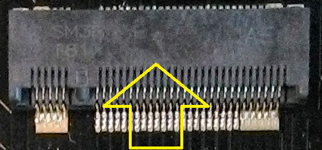

#### Horisontal Socket Terminal Description
LOKA board is can only be plugged on the direction shown by the yellow arrow on image.
The image below is an example with a LOKA board connected in socket.
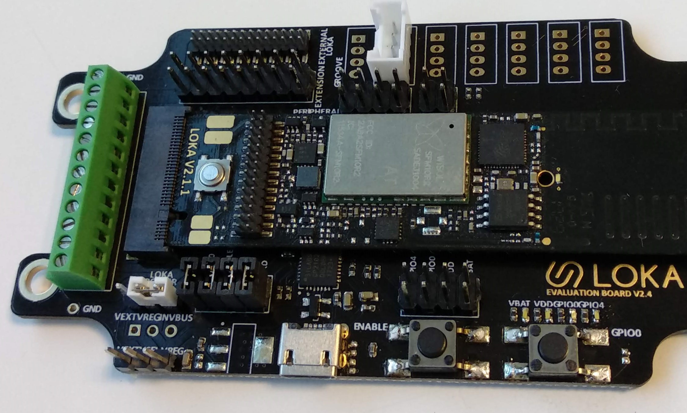

## D - Extension Terminal 

#### Extension Terminal Image
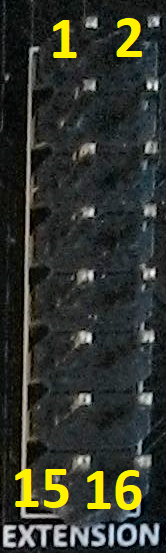

#### Extension Terminal Description Table

| Hdr # | PIN / GPIO | RTC GPIO | I/O Capability | Pull-Up / Pull-Down | ADC / DAC / SPI |
|-------|------------|----------|----------------|---------------------|-----------------|
| 1     | VEXT       |          |                |                     |                 |
| 2     | GND        |          |                |                     |                 |
| 3     | VDD_PER    |          |                |                     |                 |
| 4     | GND        |          |                |                     |                 |
| 5     | VBAT       |          |                |                     |                 |
| 6     | GPIO22     | GPIO3    | I              | NA                  | ADC1_CH3        |
| 7     | GPIO19     | NA       | I/O            | NA                  | NA              |
| 8     | GPIO13     | GPIO14   | I/O            | NA                  | ADC2_CH4        |
| 9     | GPIO25     | GPIO6    | I/O            | NA                  | ADC2_CH8        |
| 10    | GPIO14     | GPIO16   | I/O            | NA                  | ADC2_CH6        |
| 11    | GPIO39     | GPIO3    | I              | NA                  | ADC1_CH3        |
| 12    | GPIO26     | GPIO7    | I/O            | NA                  | ADC2_CH9        |
| 13    | GPIO37     | GPIO1    | I              | NA                  | ADC1_CH1        |
| 14    | GPIO38     | GPIO2    | I              | NA                  | ADC1_CH2        |
| 15    | GPIO36     | GPIO0    | I              | NA                  | ADC1_CH0        |
| 16    | GND        |          |                |                     |                 |

## E - External Loka Connection Terminal 

#### External Loka Connection Image
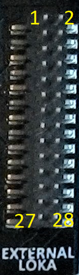

#### External Loka Connection Description Table
| **Hdr #** | **PIN / GPIO** 	| **RTC GPIO** 	| **I/O Capability** 	| **Pull-Up / Pull-Down** 	| **Reserved**    	| **ADC / DAC / SPI**   	|
|------	|------------	|----------	|-------------------	|-------------------	|-------------	|------------------	|
| 1  | GND    	    |     	    |                   	|                   	|             	|               	|
| 2 		| VBAT   	    |     	    |                   	|                   	|             	|               	|
| 3 		| GPIO1      	|          	| I/O               	| PU                	| U0TXD       	|                  	|
| 4 		| VSUPPLY  	  |     	    |                   	|                   	|             	|               	|
| 5 		| GPIO22     	|          	| I                 	| PD                	| SPI_SDO     	| SDO              	|
| 6 		| GPIO21     	|          	| I/O               	| PU                	| RADIO_CTL0  	|                  	|
| 7 		| GPIO5      	|          	| I/O               	| PU*               	| SPI_CSN_ACC 	|                  	|
| 8 		| GPIO3      	|          	| I/O               	| PU                	| U0RXD       	|                  	|
| 9 		| GPIO16     	|          	| O                 	| PD*               	| DCDC_LVL    	|                  	|
| 10 		| GPIO19     	|          	| O                 	| PD                	| SPI_SDI     	| SDI              	|
| 11 		| GPIO0      	| GPIO11   	| I/O               	| PU*               	| LED         	|                  	|
| 12 		| GPIO17     	|          	| I/O               	| PU                	| RADIO_CTL1  	|                  	|
| 13 		| GPIO15     	| GPIO13   	| I/O               	| PU*               	|             	| ADC2_CH3         	|
| 14 		| GPIO4      	| GPIO10   	| I/O               	| PD*               	|             	| ADC2_CH0         	|
| 15 		| GPIO12     	| GPIO15   	| I/O               	| PD*               	|             	| ADC2_CH5         	|
| 16 		| GPIO2      	| GPIO12   	| I/O               	| PD*               	|             	| ADC2_CH2         	|
| 17 		| GPIO27     	| GPIO17   	| O                 	| PU*               	| DCDC_ON     	|                  	|
| 18 		| GPIO13     	| GPIO14   	| I/O               	|                   	|             	| ADC2_CH4         	|
| 19 		| GPIO25     	| GPIO6    	| I/O               	|                   	|             	| ADC2_CH8 / DAC_1 	|
| 20   	| GPIO14     	| GPIO16   	| I/O               	|                   	|             	| ADC2_CH6         	|
| 21   	| GPIO39     	| GPIO3    	| I                 	|                   	|             	| ADC1_CH3         	|
| 22   	| GPIO26     	| GPIO7    	| O                 	|                   	| SPI_SCLK    	| SCLK             	|
| 23   	| GPIO37     	| GPIO1    	| I                 	|                   	|             	| ADC1_CH1         	|
| 24   	| GPIO38     	| GPIO2    	| I                 	|                   	|             	| ADC1_CH2         	|
| 25   	| ENABLE     	|          	| I                 	| PU*               	| RESET       	|                  	|
| 26   	| GPIO36     	| GPIO0    	| I                 	|                   	|             	| ADC1_CH0         	|
| 27	| GND    	    |     	    |                   	|                   	|             	|               	|
| 28      | VDD    	    |     	    |                   	|                   	|             	|               	|

## F - Serial Programming Jumper Pins 

By default, the user has to put 4 jumpers as the image below to program a loka device.
#### Serial Programming Jumper Pins Image
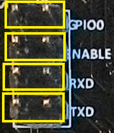

## G - Micro USB Connector 

Micro USB connector will emulate a serial COM port.
#### Micro USB Connector Image
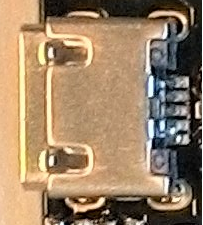

## H - Peripheral power jumper terminal 

Jumper position to power a peripheral is shown in the image below.

#### Peripheral power jumper terminal image
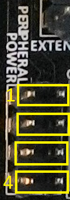

#### Peripheral power jumper terminal Table
| Jumper # | Connection to VPER |
|-------|------------|
| 1     | VDD (GPIO4 Active Low)  |
| 2     | VDD       |
| 3     | VBAT       |
| 4     | VBUS       |

## I - External Peripheral Connectors 

#### External Peripheral Connectors image
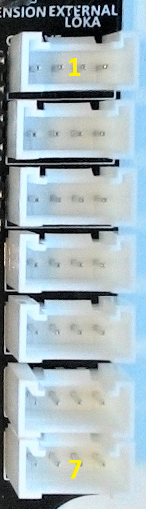

#### External Peripheral Connectors Table
| Connector # | Pin 1 (from left to right in image)| Pin 2 | Pin 3 | Pin 4 |
|-------|------------|------------|------------|------------|
| 1     | GND  | VDD_PER | GPIO14 | GPIO13 |
| 2     | GND  | VDD_PER | GPIO25 | GPIO14 |
| 3     | GND  | VDD_PER | GPIO39 | GPIO25 |
| 4     | GND  | VDD_PER | GPIO38 | GPIO39 |
| 5     | GND  | VDD_PER | GPIO37 | GPIO38 |
| 6     | GND  | VDD_PER | GPIO36 | GPIO37 |
| 7     | GND  | VDD_PER | Not Connected | GPIO36 |

**NOTE:** Connector 2 Pin 3 and Pin 4 can be pulled up on I2C Jumper terminal. The configuration will be explained in next section (J).

## J - I2C Jumper terminal 

Jumper position to power a peripheral is shown in the image below.

#### I2C Jumper terminal image
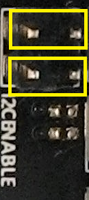

#### I2C Jumper terminal Table
| Jumper # | VPER pullup |
|-------|------------|
| 1     | GPIO25  |
| 2     | GPIO14  |

**Attention:** If one or two of this jumpers are placed, all connections to GPIO14 and/or GPIO25 will be affected.

## K - Enable LED jumper terminal 

Jumper position to power a LED is shown in the image below.

#### Enable LED jumper terminal image
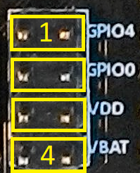

#### Enable LED jumper terminal Table
| Jumper # | LED Power |
|-------|------------|
| 1     | GPIO4  |
| 2     | GPIO0  |
| 3     | VDD    |
| 4     | VBAT   |

## L - Buttons 

#### Buttons Image
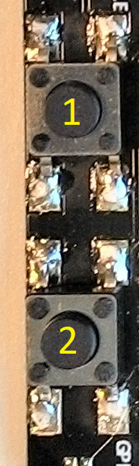

#### Buttons Table
| Button # | Function |
|-------|------------|
| 1     | Enable/Reset     |
| 2     | GPIO0 (generic)  |

## M - LEDs 

#### Enable LED jumper terminal image
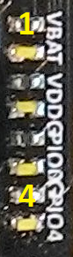

#### Enable LED jumper terminal Table
| LED # | Active Function |
|-------|------------|
| 1     | VBAT    |
| 2     | VDD     |
| 3     | GPIO0   |
| 4     | GPIO4   |

The led will be active if Active Function is active (Power on)

## Default Pin configuration 

In the image below, inside the yellow circle, are the default jumper configuration.

#### Default Pin configuration example image
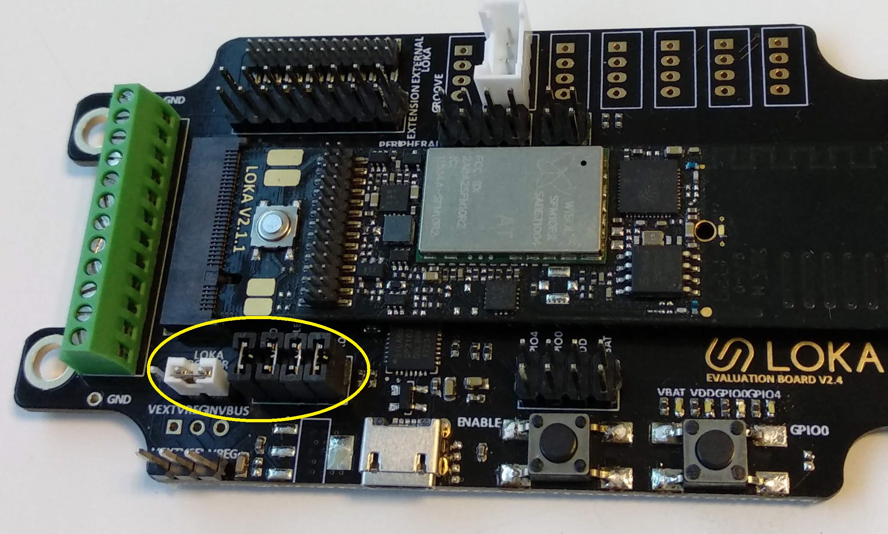
